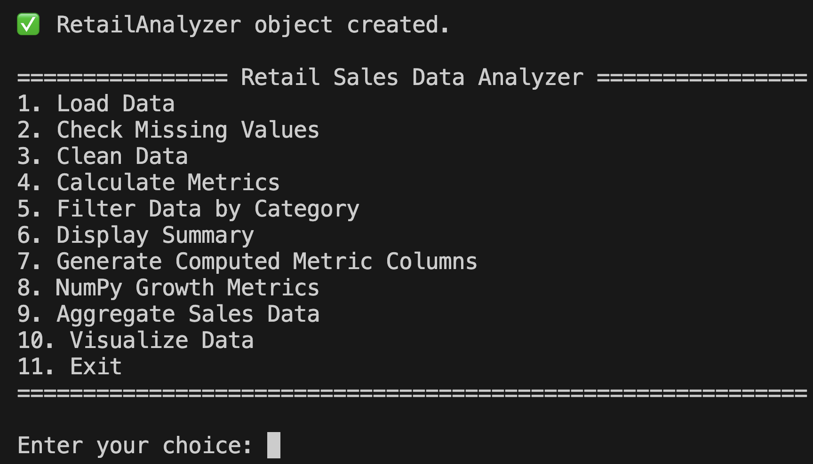
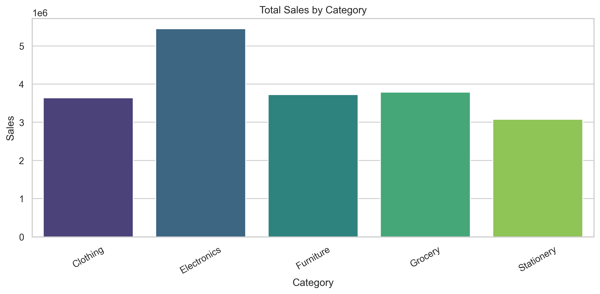
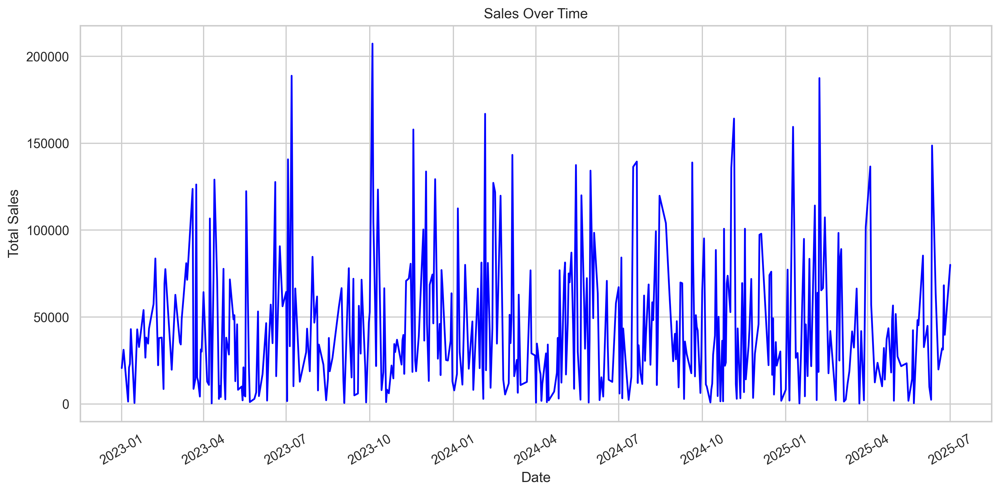
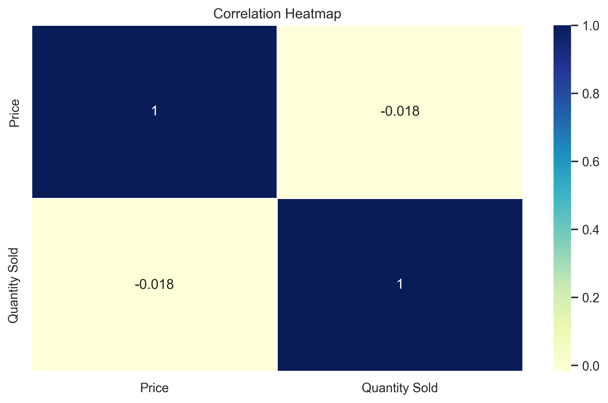

# 🏪 Retail Sales Data Analyzer

> 🚀 Created by **Parth Shah** — Visionary Developer | Data Enthusiast | Problem Solver  
> “Where Python meets retail intelligence.”

---

## 🌟 A Message from the Creator

Welcome to a data-driven revolution in retail analysis!  
This isn’t just a Python project — it’s a full-fledged **data intelligence suite** that brings clarity, precision, and power to raw sales data. I envisioned this project as a benchmark of **clarity in code**, **elegance in design**, and **depth in functionality** — to show the world what a student can build when passion meets purpose.

Let’s dive into the future of data analytics — built with 🧠 logic, 📊 insight, and 💻 discipline.

---

## 📚 Table of Contents

- [🎯 Project Overview](#-project-overview)
- [🧪 Tech Stack](#-tech-stack)
- [⚙️ Features & Functionalities](#️-features--functionalities)
- [🧠 Behind the Code](#-behind-the-code)
- [📊 Demo & Screenshots](#-demo--screenshots)
- [🚀 How to Use](#-how-to-use)
- [💬 FAQs](#-faqs)
- [📁 Project Structure](#-project-structure)
- [⚙️ Installation & Setup](#️-installation--setup)
- [🖼 Image Upload Guide (For Mac + VS Code)](#-image-upload-guide-for-mac--vs-code)
- [✨ Highlights](#-highlights)
- [🌟 Final Thoughts + Let’s Connect](#-final-thoughts--lets-connect)

---

## 🎯 Project Overview

### 📝 Objective

Develop a powerful Python-based **Retail Sales Data Analyzer** to:
- Clean & validate input data 🧼
- Analyze key metrics like Total Sales, Avg Sales, Top Product 📊
- Filter, sort, and aggregate sales by custom logic 🔍
- Generate stunning visualizations using Matplotlib & Seaborn 📈

### 🔍 Problem Statement

Sales data is messy. Insights are buried.  
**Your job?** Create a sleek command-line application that acts as a complete retail dashboard — capable of **processing**, **analyzing**, and **visualizing** any `.csv` retail dataset.

---

## 🧪 Tech Stack

| 🛠 Technology | 💬 Description |
|--------------|----------------|
|  | Core logic and scripting |
|  | Growth rates, numerical computation |
|  | Data loading, cleaning, analysis |
|  | Line & bar charts |
|  | Aesthetic statistical plots |

---

## ⚙️ Features & Functionalities

### 🛠️ Core Functionalities

- ✅ Load & Validate CSV Retail Data
- 🧼 Check & Clean Missing Values
- 📊 Calculate Key Metrics:
  - Total Sales
  - Average Sales
  - Most Popular Product
- 🧮 Generate Computed Columns:
  - Sales Percentage
  - Cumulative Sales
  - High Sales Flag
- 📂 Filter Records:
  - By Category
  - By Date Range
- 📉 NumPy-Based Growth Metrics:
  - Growth Rate Calculation
  - Sales Percentages
- 🔢 Aggregate Sales:
  - By Product
  - By Category
  - By Date
- 📈 Visualizations:
  - Bar Chart (Sales by Category)
  - Line Plot (Sales Over Time)
  - Heatmap (Correlation of Price & Quantity)
- 💾 Save Any Chart to PNG File

✅ **Data Input & Validation** — Upload CSV, verify format, detect missing values  
✅ **Object-Oriented Architecture** — Encapsulated methods for data loading, filtering, metrics  
✅ **Data Manipulation** — Clean, compute new columns, aggregate by logic  
✅ **NumPy Metrics** — Sales %, growth rate  
✅ **Visualization Suite** — Bar chart, line chart, heatmap  
✅ **User Interaction** — Console-driven menus for ease of use  

---

## 🧠 Behind the Code

Every function was crafted to demonstrate Python best practices:
- 🧼 Control structure for validation and cleaning
- 💡 OOP structure with a `RetailAnalyzer` class
- 🔬 Use of NumPy for array-based metric analysis
- 🧹 Pandas for smart data wrangling
- 📈 Beautiful plots with Matplotlib and Seaborn

---

## 📊 Demo & Screenshots

### 🧭 Main Menu


### 📊 Total Sales by Category


### 📈 Sales Over Time


### 🔥 Price vs Quantity Correlation


---

## 🚀 How to Use

1. Clone this repository:
    ```bash
    git clone https://github.com/yourusername/retail-sales-analyzer.git
    cd retail-sales-analyzer
    ```
2. Install dependencies:
    ```bash
    pip install -r requirements.txt
    ```
3. Run the program:
    ```bash
    python Visualizer.py
    ```
4. Upload the `Superstore.csv` file and interact via the terminal-based menu.

---

## 💬 FAQs

<details>
<summary><strong>📁 What should my CSV file look like?</strong></summary>
Columns: Date, Product, Category, Price, Quantity Sold, Total Sales
</details>

<details>
<summary><strong>⚠️ Getting error loading file?</strong></summary>
Ensure it's a `.csv` with proper column names and structure.
</details>

<details>
<summary><strong>📈 How do I save charts?</strong></summary>
You'll be prompted after viewing the chart.
</details>

---

## 📁 Project Structure

```
Retail-Sales-Data-Analyzer/
├── retail_analyzer.py
├── retail_sales.csv
├── README.md
├── requirements.txt
└── images/
    ├── Demo_1.png
    ├── BarChart.png
    ├── LineChart.png
    └── HeatMap.png
```

---

## ⚙️ Installation & Setup

```bash
pip install -r requirements.txt
python retail_analyzer.py
```

---

## 🖼 Image Upload Guide (For Mac + VS Code)

1. Create a folder called `images`  
2. Place all screenshots inside it  
3. Use Markdown like:  
```markdown

```

✅ Use clean names like `chart1.png`, `demo_main.png`, etc.

---

## ✨ Highlights

- 🧠 Pure Python logic — ideal for educational & real-world datasets.
- 📋 Modular, reusable, and scalable code design.
- 🖥️ Clean and interactive terminal interface.
- 📉 Professional-quality charts using Seaborn and Matplotlib.
- 📁 Built for beginners, coded like a pro.

---

## 🌟 Final Thoughts + Let’s Connect

Made with 🧠, 🔥, and 💙 by **The Parth Shah**.

If this helped you or inspired you in any way:
- ⭐ Star this repo
- 💬 Share your feedback
- 🤝 Let’s connect on [LinkedIn](https://www.linkedin.com/in/parth-shah-28387532b/?utm_source=share&utm_campaign=share_via&utm_content=profile&utm_medium=ios_app)

> “I don’t just code. I craft data-driven experiences.” — **THE PARTH SHAH**

---


